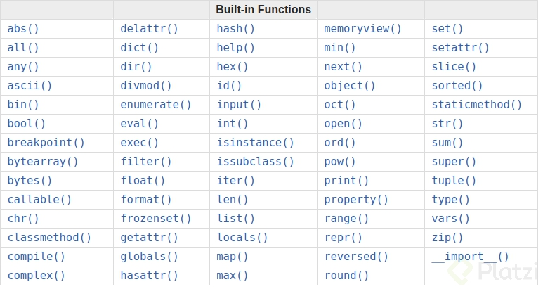
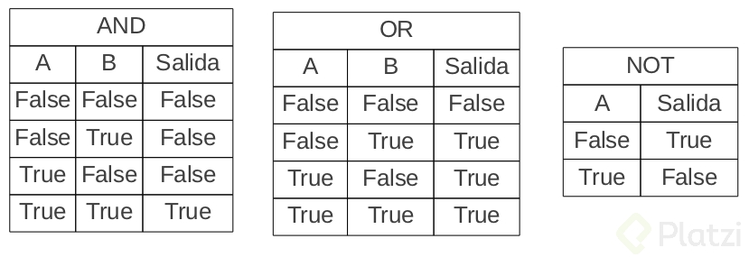

- [Curso de Python 2018 de Platzi con David Aroesti](#curso-de-python-2018-de-platzi-con-david-aroesti)
  - [Palabras reservadas de Python](#palabras-reservadas-de-python)
  - [Variables y expresiones](#variables-y-expresiones)
  - [Funciones](#funciones)
  - [Estructuras condicionales](#estructuras-condicionales)

# Curso de Python 2018 de Platzi con David Aroesti

Este es un curso introductorio para aprender a programar con Python de Platzi. Es la última actualización de 2018 con David Aroesti nuevamente como profesor.

## Palabras reservadas de Python

Estas son palabras que por ningún motivo debemos usar como variables, ya que nos ocasionarán errores de compilación en Python

|Palabra|Palabra  |Palabra  |Palabra  |Palabra|
|-------|---------|---------|---------|-------|
| False | await   | else    | import  | pass  |
| None  | break   | except  | in      | raise |
| True  | class   | finally | is      | return|
| and   | continue| for     | lambda  | try   |
| as    | def     | from    | nonlocal| while |
| assert| del     | global  | not     | with  |
| async | elif    | if      | or      | yield |

## Variables y expresiones

- Una expresion (__expression__) es una combinación de valores, variables y operadores.

```python
2 + 2
```

- Un enunciado (__statement__) es una unidad de código que tiene un efecto

```python
age = 20
```

- Orden de operaciones PEMDAS
  - Paréntesis
    - Exponente
      - Multiplicación
      - División
        - Adición
        - Substracción

## Funciones

En el contexto de la programación las funciones son simplemente una agrupación de enunciados(__statments__) que tienen un nombre.

Una función tiene un nombre, debe ser descriptivo, puede tener parámetros y puede regresar un valor después que se generó el cómputo.

Python es un lenguaje que se conoce como _batteries include_ (baterías incluidas) esto significa que tiene una librería estándar con muchas funciones y librerías.

Para declarar funciones que no son las globales, las _built-in functions_, necesitamos importar un módulo.

Con el keyword `def` declaramos una función.



## Estructuras condicionales

Para comprender el flujo de nuestro programa debemos entender un poco sobre estructuras y expresiones booleanas

`==` se refiere a igualdad
`!=` no hay igualdad.
`>` mayor que
`<` menor que
`>=` mayor o igual
`<=` menor o igual

`and` unicamente es verdadero cuando ambos valores son verdaderos
`or` es verdadero cuando uno de los dos valores es verdadero.
`not` es lo contrario al valor. Falso es Verdadero. Verdadero es Falso.

